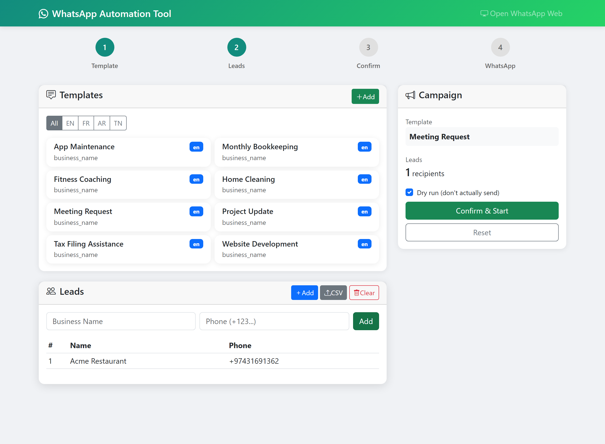

# WhatsApp Automation Tool

[](https://github.com/firaslamouchi21/-WhatsApp-Automation-Tool/actions/workflows/ci.yml)
[](https://github.com/firaslamouchi21/-WhatsApp-Automation-Tool/pkgs/container/whatsapp-automation-tool)
[](https://www.python.org/)
[](LICENSE)

**Send personalized WhatsApp messages to a list of business leads — from a point‑and‑click web dashboard, running entirely in Docker.**

Bonne journée! ness lkol, This is a simple tool to send automated WhatsApp messages to your leads. It runs entirely in Docker (no installation needed!) and gives you a visual browser interface so you can see what's happening originaly built for myself because I was tired of doing it all of the leads messaging manually.

////Note important dont exceed 100 messages per day otherwise your whatsapp account will be banned mine got banned after 40 messages sent in one day ////.

> ⚠️ **Read this first.** Note important dont exceed 100 messages per day otherwise your whatsapp account will be banned mine got banned after 40 messages sent in one day. This tool adds delays between messages, but you are responsible for how you use it. For your own outreach to people who expect to hear from you; not for spam.

<p align="center">
  
</p>

---

## Quick start

```bash
# 1. Run it (Web UI on :5000, in-container browser on :6080)
docker run -d --name wa \
  -p 5000:5000 -p 6080:6080 \
  -v "$PWD/data:/app/data" \
  ghcr.io/firaslamouchi21/whatsapp-automation-tool:latest

# 2. Open the dashboard
open http://localhost:5000
```

Then in the dashboard:

1. **Pick a template** (or create your own).
2. **Add leads** — upload a CSV or type them in.
3. **Confirm** to see a rendered preview.
4. **Open WhatsApp Web** (`http://localhost:6080/vnc.html`), scan the QR code with your phone.
5. Watch the messages send.

Your leads CSV needs at least these columns:

```csv
Business Name,Phone Number,Category
Acme Restaurant,+974 3169 1362,Food
Blue Cafe,+974 5088 5757,Food
```

---

## Features

- 🖥️ **Web dashboard** — manage templates, leads and campaigns without touching a terminal
- 🌍 **Multi‑language templates** — English, French, Arabic, Tunisian; 8 categories each
- ☎️ **Phone validation** — every number checked and normalised to E.164 via `phonenumbers`
- 👀 **Visible browser** — WhatsApp Web runs in the container, streamed to your browser over noVNC
- 🧪 **Dry‑run mode** — see exactly what would be sent, send nothing
- 🐢 **Rate limiting** — configurable delay between messages
- 🐳 **Docker‑only** — one image, runs the same everywhere
- 🖱️ **CLI too** — script it if you prefer

---

## Command line

Everything the dashboard does is also available on the CLI:

```bash
# list available templates
docker exec wa python main.py --list-templates

# check a CSV without sending anything
docker exec wa python main.py --validate-leads data/leads.csv

# preview a campaign (renders every message, sends nothing)
docker exec wa python main.py --leads data/leads.csv --template meeting_request --dry-run

# send for real
docker exec wa python main.py --leads data/leads.csv --template meeting_request
```

| Flag | Meaning |
|------|---------|
| `--leads PATH` | CSV of leads (`Business Name`, `Phone Number`, optional `Category`) |
| `--template NAME` | template id (see `--list-templates`) |
| `--dry-run` | render + log, don't send |
| `--start N` / `--end N` | process a slice of the CSV |
| `--validate-leads PATH` | just validate phone numbers and exit |
| `--list-templates` | print all template ids |

---

## Configuration

Set via environment variables (in `docker run -e ...` or a compose file):

| Variable | Default | Meaning |
|----------|---------|---------|
| `WHATSAPP_RATE_LIMIT` | `20` | seconds between messages |
| `WHATSAPP_WAIT_TIME` | `10` | seconds to wait for WhatsApp Web to load a chat |
| `LOG_LEVEL` | `INFO` | `DEBUG` / `INFO` / `WARNING` / `ERROR` |
| `SECRET_KEY` | dev key | Flask session key — **set this** if you expose the dashboard |
| `WA_DEBUG` | off | set to `1` to enable the Flask debugger (local only) |

Or mount a `config/config.yaml` — see [`config/config.yaml`](config/config.yaml) for the full shape.

---

## Message templates

Templates live in [`templates/<lang>/<category>/messages.yaml`](templates/) and use `{business_name}` / `{category}` placeholders:

```yaml
meeting_request:
  name: "Meeting Request"
  template: |
    Hi {business_name},

    I'd like to schedule a short call to discuss how we can work together.
    Are you free for 15 minutes this week?
  variables: ["business_name"]
  language: en
```

| Language | Code | Categories |
|----------|------|------------|
| English | `en` | IT · accounting · work · life (8 templates) |
| French | `fr` | same |
| Arabic | `ar` | same |
| Tunisian | `tn` | same |

Add your own from the dashboard (**+ Add** on the Templates card) or by dropping a YAML file in the right folder.

---

## Run with Docker Compose

```yaml
services:
  whatsapp-automation:
    image: ghcr.io/firaslamouchi21/whatsapp-automation-tool:latest
    container_name: whatsapp-automation-tool
    ports:
      - "5000:5000"   # dashboard
      - "6080:6080"   # in-container browser (noVNC)
    volumes:
      - ./data:/app/data
      - ./templates:/app/templates
    environment:
      - WHATSAPP_RATE_LIMIT=20
      - SECRET_KEY=change-me
    restart: unless-stopped
```

```bash
docker compose up -d
```

---

## Development

The whole toolchain runs in CI (`lint` → `test` on 3.11/3.12 → live‑server `smoke` → `docker` container healthcheck). To run it locally:

```bash
git clone https://github.com/firaslamouchi21/-WhatsApp-Automation-Tool.git
cd -WhatsApp-Automation-Tool
python -m venv .venv && . .venv/bin/activate      # Windows: .venv\Scripts\activate
pip install -r web_ui/requirements.txt -r requirements-dev.txt

pytest                       # unit tests
python web_ui/smoke_test.py  # web UI wiring
python web_ui/app.py         # dashboard on http://localhost:5000
```

`black`, `isort`, `flake8` and `mypy` config is in [`pyproject.toml`](pyproject.toml); `pre-commit install` wires them as hooks. See [CONTRIBUTING.md](CONTRIBUTING.md).

---

## Why this exists

Built by [@firaslamouchi21](https://github.com/firaslamouchi21) after one too many evenings pasting the same message into WhatsApp Web by hand for a list of leads. If it saves you that time too, a ⭐ is appreciated — and issues / PRs are welcome.

## License

[MIT](LICENSE).
